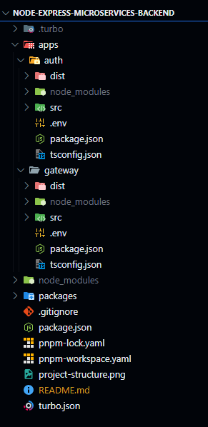

# Node Express Microservices Backend

A modern microservices backend built with Node.js, Express, and TypeScript using a monorepo structure.

## Tech Stack

- Node.js
- Express.js
- TypeScript
- pnpm (Package Manager)

#### Some other packages this starter project have -

- tsx (A fast typescript transpiler (or compiler, wtv you wanna call it)) # You could simply use tsc (the built in typescript compiler) instead of tsx
- turbo (An efficient build tool, great for handling build tasks in such monorepos at scale)

## Prerequisites

- Node.js 18+
- pnpm

## Project Structure

## Getting Started

1. Clone the repository:
   git clone https://github.com/Muaz-Hasan/node-microservices-starter.git

   cd node-express-microservices-backend

2. Install dependencies:
   pnpm install

3. Start the development environment:
   pnpm run dev # or turbo dev

## Available Scripts

- `pnpm run dev`: Start the development environment
- `pnpm run build`: Build the project
- `pnpm run test`: Run tests

## Discussion

If you are stuck somewhere or don't understand something, feel free to make a post in the discussions

## Contributing

Contributions are welcome! Please open an issue or submit a pull request.

## License

This project is licensed under the MIT License.
